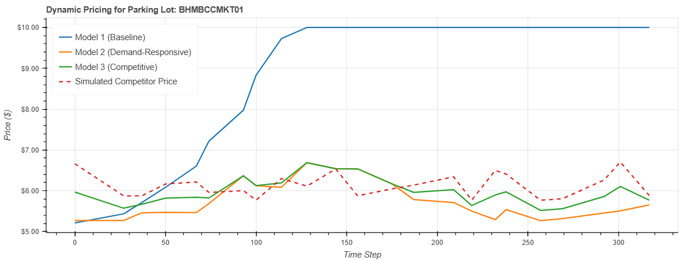
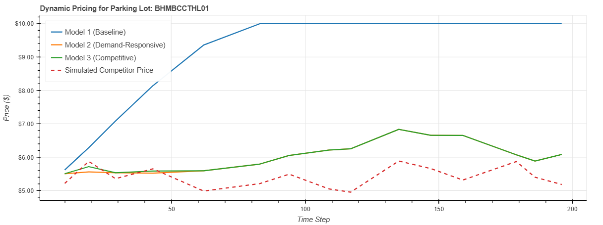
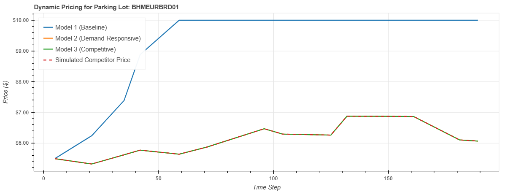
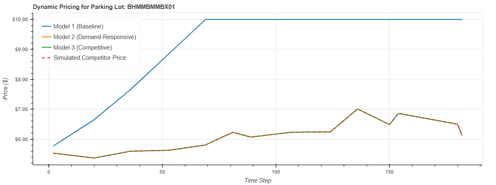
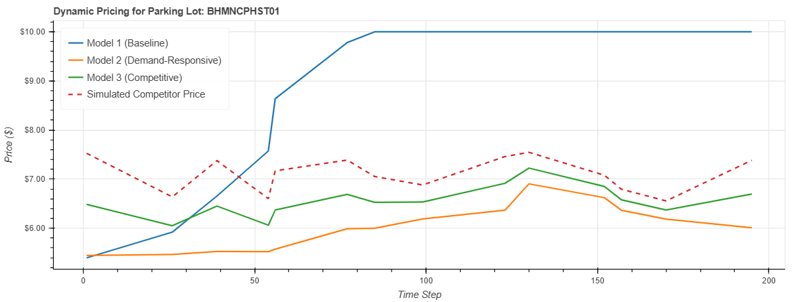

# Dynamic Pricing for Smart Parking

This project implements and simulates three distinct dynamic pricing models for a smart parking system. The goal is to analyze how different strategies—ranging from a simple baseline to a complex competitive model—affect parking prices based on real-time data. The simulation is visualized using the Bokeh library to provide an interactive, real-time comparison of the models.

## 📋 Table of Contents
* [Overview](#-overview)
* [Features](#-features)
* [Technology Stack](#-technology-stack)
* [Pricing Models](#-pricing-models)
    * [Model 1: Baseline Linear Approach](#model-1-baseline-linear-approach)
    * [Model 2: Demand-Responsive Pricing](#model-2-demand-responsive-pricing)
    * [Model 3: Competitive Pricing](#model-3-competitive-pricing)
* [Visualizations & Results](#-visualizations--results)

## 📝 Overview

The core of this project is a simulation that processes a dataset of parking lot occupancy over time. For each parking lot and at each time step, the simulation calculates a new price using three different algorithms. These models leverage factors like occupancy rate, traffic conditions, queue length, and proximity to competitors to make pricing decisions. The dynamic updates are plotted in real-time to visualize the behavior and effectiveness of each pricing strategy.

## ✨ Features

* **Data Pre-processing**: Cleans and prepares raw parking data for simulation.
* **Three Pricing Models**: Implements baseline, demand-responsive, and competitive pricing algorithms.
* **Real-time Simulation**: Iterates through time-stamped data to simulate a real-world environment.
* **Interactive Visualizations**: Uses Bokeh to generate and update plots in real-time within a Jupyter Notebook, comparing the price evolution for each model.

## 💻 Technology Stack

* **Python**: Core programming language.
* **Pandas**: For data manipulation and analysis.
* **NumPy**: For numerical operations.
* **Bokeh**: For creating interactive and real-time data visualizations.
* **Jupyter Notebook**: For development and presentation.

## 📈 Pricing Models

Three different models were developed to explore various dynamic pricing strategies.

### Model 1: Baseline Linear Approach
This is a simple linear model where the price increases proportionally to the parking lot's occupancy rate. It serves as a basic benchmark for comparison.

**Formula:**
`Price_{t+1} = Price_t + \alpha \times (\frac{Occupancy}{Capacity})`

### Model 2: Demand-Responsive Pricing
This model calculates a composite "demand score" based on multiple real-time factors:
* Occupancy Rate
* Queue Length
* Nearby Traffic Conditions
* Vehicle Type (e.g., car, bike)
* Special Days (e.g., holidays, events)

The final price is adjusted from a base price using the normalized demand score, allowing it to react more intelligently to various conditions.

**Formula:**
`Price = Base Price \times (1 + \lambda \times NormalizedDemand)`

### Model 3: Competitive Pricing
This model builds upon Model 2 by adding a competitive dimension. It identifies nearby competitor parking lots using the **Haversine distance** formula. The price is then adjusted based on the average price of these competitors, allowing the model to either undercut or align with the market. If no competitors are found within a given threshold, it defaults to the price calculated by Model 2.

## 📊 Visualizations & Results

The simulation generates dynamic plots for various parking lots. Below are the final states of the plots for five different lots, showing a comparison of the three models against a simulated competitor price.

**Observations:**
* **Model 1 (Baseline)** consistently and aggressively raises prices as occupancy increases, quickly hitting the maximum price cap of $10.00. This approach is not very adaptive.
* **Model 2 (Demand-Responsive)** and **Model 3 (Competitive)** show more nuanced and stable pricing, fluctuating in a tighter, more realistic range.
* In plots where competitor prices are influential (e.g., for lots BHMBCCMKT01 and BHMNCPHST01), **Model 3**'s price (green line) visibly adjusts to follow or react to the **Simulated Competitor Price** (red dashed line).
* In other plots (e.g., for lot BHMEURBRD01), the lines for Model 2 and Model 3 overlap perfectly, indicating that no nearby competitors were found, and Model 3 defaulted to Model 2's logic.

| Parking Lot: BHMBCCMKT01 | Parking Lot: BHMBCCTHL01 |
| :---: | :---: |
|  |  |
| **Parking Lot: BHMEURBRD01** | **Parking Lot: BHMMBMMBX01** |
|  |  |
| **Parking Lot: BHMNCPHST01** |
|  |

